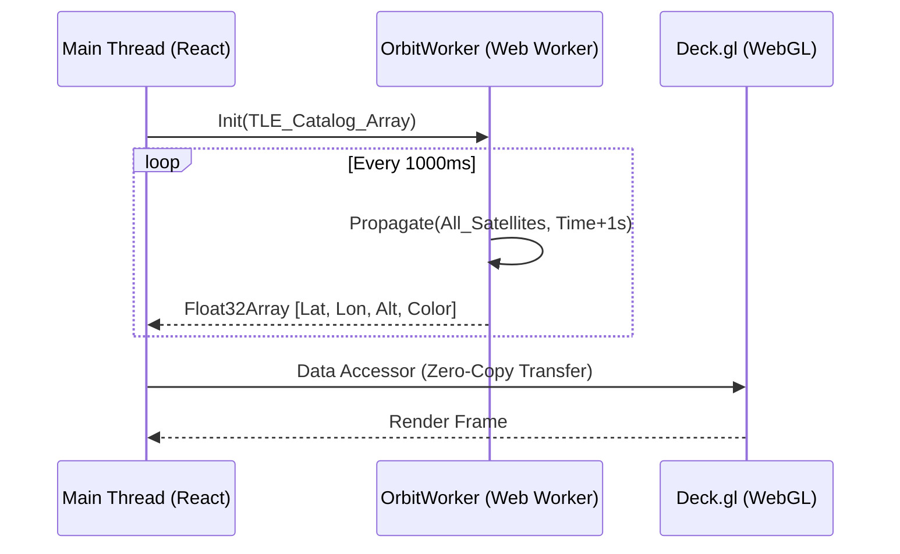

# Tactical Dashboard Architecture

> **Design Document for the SIS-PRO Frontend**  
> *Targeting 60FPS rendering of 20,000+ orbital objects and real-time spectrum waterfalls.*

## 1. Technology Stack

*   **Core Framework**: `React 18` + `Vite` (TypeScript).
*   **State Management**: `Zustand` (Transient state updates outside React render cycle).
*   **3D Geospatial Engine**: `Deck.gl` (WebGL2 overlay) + `MapLibre GL` (Vector Base Map).
*   **Physics Engine**: `satellite.js` running in a **Web Worker**.
*   **Styling**: `TailwindCSS` + `Glassmorphism` UI.

## 2. Performance Strategy

### 2.1 The "Main Thread" Bottleneck
Propagating 23,000 satellites using SGP4 takes ~150-300ms in JavaScript on a main thread. This would freeze the UI (10 FPS).

### 2.2 The Solution: Off-Main-Thread Architecture
We will utilize a **Worker-Driven Architecture**:



### 2.3 Binary Data Transfer
*   **Satellite Positions**: Transferred from Worker to Main Thread as `SharedArrayBuffer` or transferable `Float32Array` to avoid serialization overhead.
*   **Spectrum Data**: Received via WebSocket as binary blobs, rendered directly to a customized WebGL texture (Waterfall), bypassing 2D Canvas API.

## 3. Component Hierarchy

```
App
├── layout/
│   ├── NavigationRail (Left)
│   └── MissionHeader (Top)
├── features/
│   ├── Globe/ (Deck.gl)
│   │   ├── BaseMapLayer
│   │   ├── SatelliteLayer (Scatterplot)
│   │   └── OrbitPathLayer (GeoJson)
│   ├── Spectrum/
│   │   ├── WaterfallCanvas (WebGL Shader)
│   │   └── FFTDisplay (D3/Canvas)
│   └── Intel/
│       ├── TargetList
│       └── AlertFeed
```

## 4. Key Components

### 4.1 `OrbitWorker.ts`
*   **Input**: Full TLE Catalog (JSON).
*   **Process**: 
    *   Parses TLEs once.
    *   On `tick()`, runs `propagate()` for all active satellites.
    *   Filters visible satellites based on Viewport Bounding Box (optimization).
*   **Output**: Flat packed array `[id, lat, lon, alt, id, lat, lon, alt, ...]`

### 4.2 `WaterfallCanvas.tsx`
*   **Problem**: Rendering 1024 FFT bins x 500 history lines = 500k pixels per frame. React DOM is too slow.
*   **Solution**: Custom WebGL Shader.
    *   **Texture A**: Current History.
    *   **Uniform**: New FFT Line.
    *   **Fragment Shader**: Shifts Texture A up by 1 pixel, draws new line at bottom, applies "Inferno" colormap.

### 4.3 `useSocketStream.ts` (Hook)
*   Manages the WebSocket connection to `ws://localhost:8000`.
*   Handles reconnection logic (exponential backoff).
*   Deserializes high-frequency patches.

## 5. UI/UX "War Room" Aesthetic
*   **Theme**: Dark Mode (Slate-950 background).
*   **Accents**: Cyan-500 (Friendly), Red-500 (Hostile/Unknown), Amber-500 (Warning).
*   **Typography**: `Inter` or `JetBrains Mono` for data.
*   **Visuals**: CRT scanlines effect (optional CSS overlay) for tactical feel.
