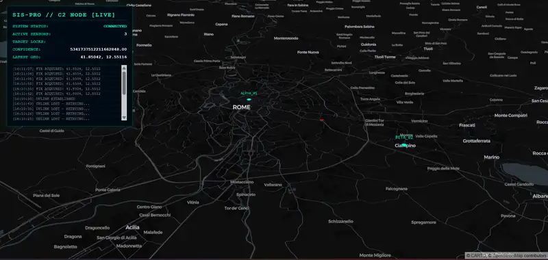

# Satellite RF Observatory

An experimental laboratory for building **falsifiable RF observations** from
capabilities that are actually available in the current session.

The project began as a satellite-identification prototype. The experiments in
this repository changed the question:

> Given a finite time budget and live Internet-accessible RF capabilities, can
> we freeze one prospective physical experiment whose positive **and negative**
> outcomes are interpretable?

Targets, frequencies, endpoints and even the phenomenon under test may emerge
only after capability qualification. A satellite is one possible model, not a
required starting point.

This is research software. It is not an operational monitoring platform, a
signal-identification service or evidence that any transmitter has been
identified.

## Current direction

The supported research surface is [`experiments/live_instrument`](experiments/live_instrument/README.md).
It contains two deliberately different branches:

| Branch | Starting point | What it tests |
|---|---|---|
| SatNOGS | model-conditioned published measurements | whether clause-driven continuity and corroboration survive source revocation and TTL expiry |
| KiwiSDR | targetless live IQ | whether a shared or intervened RF structure is distinguishable under explicit temporal, transform and causal controls |

The two branches share only the primitives that survived both:

- evaluation by contract clause, not one global health label;
- atomic receipts;
- event time and TTL;
- transform ledger;
- causal lineage;
- separation of physical decisions from descriptive/software errors;
- artifact hashing with zero RF persistence.

These are not promoted to a general framework. Each experiment must continue
to justify them.

## Latest checkpoint

Gate F2.5 removed server waterfall (`W/F`) and `ext_api` from the causal gate
for same-Kiwi multichannel qualification. Its intended path is:

```text
frozen affordances
  -> direct simultaneous SND reference + perturbed attempt
  -> two IQ streams
  -> local in-memory STFT/PSD
  -> targetless feature + witness
  -> per-channel retune qualification
  -> immutable plan
  -> one prospective A1/B/A2 confirmation
  -> one outcome
```

The first and only live F2.5 execution ended correctly as
`QUALIFICATION_INCOMPLETE`: all six `/status` requests succeeded, but the
frozen center policy expected a `bandwidth` field that the responses did not
contain. No SND channel was attempted, no IQ was acquired and
`NO_MULTI_CHANNEL_CAPABILITY` was therefore forbidden. See
[`GATE_F2_5_OUTCOME_1.md`](experiments/live_instrument/GATE_F2_5_OUTCOME_1.md).

Gate F2.5.1 now removes that last pre-SND dependency offline. It freezes a
conservative Kiwi-family tuning interval and derives a qualification-only
coordinate without reading `status.bandwidth`; W/F remains absent and
`ext_api` remains a hint. The original outcome is unchanged, and no live
connection was made while preparing that offline checkpoint. See
[`GATE_F2_5_1_OFFLINE.md`](experiments/live_instrument/GATE_F2_5_1_OFFLINE.md).

The single authorised F2.5.1 live session then reached real dual-SND attempts
on every frozen candidate. One endpoint explicitly rejected public SND access;
the others remained indeterminate after WebSocket timeout/closure errors. The
terminal result is `QUALIFICATION_INCOMPLETE`, not a claim that multichannel
capability is absent. No topology, feature, plan or DDC hypothesis was
admitted. See
[`GATE_F2_5_1_OUTCOME_1.md`](experiments/live_instrument/GATE_F2_5_1_OUTCOME_1.md).

Gate F2.5.2 addresses that outcome strictly offline. It records reference and
perturbed opening as separate atomic receipts, hashes every ephemeral SND
frame before decode, and preserves any single-branch readiness witness even
when the peer fails. It does not change the candidates, tuning policy,
thresholds or DDC question, and no new live connection has been made. See
[`GATE_F2_5_2_OFFLINE.md`](experiments/live_instrument/GATE_F2_5_2_OFFLINE.md).

The single F2.5.2 live session ended as `QUALIFICATION_INCOMPLETE`, but its
atomic boundary exposed a real asymmetric result: one KFS reference branch
reached GNSS IQ readiness with two pre-decode-hashed frames while its perturbed
peer was explicitly rejected. No pair or DDC hypothesis was admitted. The run
also exposed two descriptive-control failures: retry eligibility still
depended on aggregate prose, and stdout-only receipts were not fully retained.
See
[`GATE_F2_5_2_OUTCOME_1.md`](experiments/live_instrument/GATE_F2_5_2_OUTCOME_1.md).

Gate F2.5.3 corrects those two control failures offline. Retry eligibility now
comes only from atomic branch state and typed transport errors; aggregate prose
cannot enable or disable it. A future session writes one bounded,
exclusive-create, strict-JSONL artifact containing descriptive receipts and
hashes while rejecting RF arrays and raw/derived sample fields. Sink or
serialization failure is descriptive and cannot alter the physical result.
No live connection was made. See
[`GATE_F2_5_3_OFFLINE.md`](experiments/live_instrument/GATE_F2_5_3_OFFLINE.md).

The pre-execution review found that F2.5.3's final artifact hash and emission
errors were returned in memory but discarded by its command-line entry point.
Gate F2.5.3.1 closes that final audit gap offline: the same JSONL ends with a
reserved terminal manifest containing a byte-exact prefix hash and retention
state, while the CLI exposes the closed file's overall hash. Runtime,
serialization and mirror failures remain descriptive. No network activity was
performed. See
[`GATE_F2_5_3_1_OFFLINE.md`](experiments/live_instrument/GATE_F2_5_3_1_OFFLINE.md).

The single authorised F2.5.3.1 session then exercised all six frozen
candidates and exactly the two allowed structured retries. No branch delivered
an IQ frame: explicit branch rejections coexisted with transport closures or a
timeout, so the correct outcome is `QUALIFICATION_INCOMPLETE`, not absence of
multichannel capability. No topology, feature, plan or DDC hypothesis was
evaluated. The 53-line receipt artifact closed `COMPLETE`, with matching prefix
and whole-file hashes and zero RF persistence. See
[`GATE_F2_5_3_1_OUTCOME_1.md`](experiments/live_instrument/GATE_F2_5_3_1_OUTCOME_1.md).

Gate F2.5.4 audits that frozen outcome without network activity. Four branch
receipts are explicit server-reported rejections, one is a timeout before any
server MSG, and eleven are not causally diagnosable from the retained fields.
In particular, `configuration_sent` records a local action, not remote
acceptance. Because all endpoints share one client implementation root and the
official frozen source revisions are not present locally, the correct exit is
`STOP_PENDING_CONTROL_DISCRIMINATORS`, not a protocol fix or another run. See
[`GATE_F2_5_4_PROTOCOL_AUDIT.md`](experiments/live_instrument/GATE_F2_5_4_PROTOCOL_AUDIT.md).

Gate F2.5.5 now specifies the missing control boundary offline. It keeps an
official-source clause separate from the ordered receipt clause, distinguishes
local command result, remote server field, WebSocket close, TCP loss and first
IQ, and forbids credentials or RF persistence. Because the pinned official
source artifacts and exact kiwiclient control path are not retained locally,
it fails closed as `SOURCE_BASIS_INCOMPLETE`; no implementation or live run is
authorised. See
[`GATE_F2_5_5_OFFLINE.md`](experiments/live_instrument/GATE_F2_5_5_OFFLINE.md).

Gate F2.5.6 then retrieved only the two official repositories at their frozen
commits; it made no Kiwi connection and acquired no RF. The minimal server
source is now retained and verified byte-for-byte. The exact kiwiclient paths
are resolved and hash-audited, but its source is not copied because no license
grant was found at the pinned revision. The correct fail-closed result is
`SOURCE_RETENTION_BLOCKED_BY_LICENSE`: protocol semantics are narrower and
better grounded, while the complete source basis is still not locally
reproducible. See
[`GATE_F2_5_6_SOURCE_REPRODUCTION.md`](experiments/live_instrument/GATE_F2_5_6_SOURCE_REPRODUCTION.md).

Gate F2.5.7 audits whether that client-retention limit actually blocks the
physical question. It does not: server semantics, ordered local sends and a
later hashed IQ witness are sufficient, while the reference client cannot
manufacture a configuration ACK the protocol does not expose. Synthetic
transcripts now distinguish auth, channel allocation, local `mod_iq`, IQ,
clean close and transport loss. The offline result is
`SERVER_WIRE_CONTRACT_SUFFICIENT`; receipt implementation may be prepared in a
separate gate, but no live execution is authorised. See
[`GATE_F2_5_7_SERVER_WIRE_AUDIT.md`](experiments/live_instrument/GATE_F2_5_7_SERVER_WIRE_AUDIT.md).

## What can be claimed

Receipts may support narrow statements such as:

- a measurement satisfied a named clause before its TTL expired;
- two SND streams were simultaneous and independently sequenced;
- a feature behaved consistently with being upstream of a per-channel DDC;
- an observation was unavailable, unresolved, not detectable or not evaluated.

They do **not** automatically support:

- transmitter or satellite identity;
- external-RF origin;
- common physical cause;
- geolocation or TDoA;
- absence of a phenomenon when detectability was not established;
- multichannel unavailability when a second channel was never attempted.

## Quick start: offline verification

Python 3.11 or 3.12 is recommended.

```bash
python -m venv .venv

# Linux/macOS
source .venv/bin/activate

# Windows PowerShell
# .venv\Scripts\Activate.ps1

python -m pip install -r requirements-live-instrument.txt
python -m pytest experiments/live_instrument/tests -q
```

The test suite is offline. It uses deterministic fixtures and synthetic IQ;
it does not contact SatNOGS, KiwiSDR or any other remote service.

## Live execution policy

Live runners are disposable experiment materializations, not daemons.

- Never run them as part of installation, import, tests or CI.
- Freeze candidates, order, transforms, thresholds, retry budget and stop
  condition before network access.
- Use only public capabilities and respect receiver-owner access limits.
- Retry only pre-freeze software/transport failures allowed by the frozen plan.
- After plan freeze: zero retry, endpoint change, frequency change, threshold
  change or second confirmation window.
- Hash ephemeral RF artifacts before analysis and destruction; persist only
  strict JSON receipts and hashes.

Every new live session requires explicit authorization. The repository's
documented outcomes must remain unchanged after the fact; fixes belong to a
new gate and a new commit.

## Repository map

```text
experiments/live_instrument/
  models.py                 strict receipts, clause and JSON boundary
  orbital_kernel.py         stateless Skyfield geometry/Doppler kernel
  satnogs_probe.py          model-conditioned published artifacts
  satnogs_failover.py       clause-driven continuity/corroboration failover
  kiwi_probe.py             targetless dual-Kiwi capture and in-session nulls
  kiwi_prospective.py       discovery/prediction/confirmation separation
  kiwi_gate_e.py            detectability and qualification experiments
  kiwi_gate_f2*.py          capability-first and same-Kiwi DDC interventions
  tests/                     offline deterministic test suite
  CHECKPOINT_*.md            checkpoint evidence
  GATE_*.md                  frozen plans, outcomes and postmortems

analysis/, collectors/, processors/, trackers/
  original offline satellite-first prototype

api/, workers/, core/, receivers/
  legacy architecture retained for reference; not the supported path
```

For mechanisms and state semantics, read
[`README_TECHNICAL.md`](README_TECHNICAL.md). For the next bounded work, read
[`ROADMAP.md`](ROADMAP.md).

## Original proof of concept



The image records the original product exploration. Its labels, confidence,
locations and events are demonstration output, not validated telemetry or
satellite identifications. No supported frontend is currently included.

## Legacy offline prototype

The original SDR-to-disk and satellite-candidate code remains available through
`gray_system_main.py`. It is exploratory and is not the validated output of
the live-instrument gates. In particular:

- encryption and secure export are not implemented;
- metadata-scrubbed captures are incompatible with the current reader;
- Doppler proximity is candidate ranking, not identification;
- old API, Redis, PostgreSQL and frontend documents are historical.

## Legal and ethical use

Use this repository only for lawful education, amateur-radio experimentation,
spectrum research and signals you are authorized to receive and process. It
does not transmit, jam, decrypt or bypass access controls. Public receiver
availability is not a blanket license to record or redistribute content.
Operators are responsible for applicable radio, privacy and data-retention law.

## License

Apache License 2.0. See [`LICENSE`](LICENSE).
