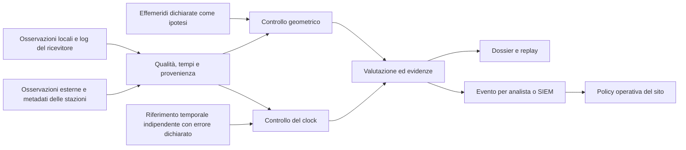

# Sicurezza PNT: verifica esterna e analisi degli incidenti

Piano di sviluppo del 26 settembre 2026. Direzione richiesta dall'utente;
architettura proposta, ancora da dimostrare. Questo documento sostituisce le
priorità di prodotto precedenti. Esperimenti conclusi, risultati e criteri
storici conservano il loro significato originale.

## Obiettivo e primo utilizzatore

Costruire un framework aperto che confronta le osservazioni GNSS di un sistema
locale con osservazioni esterne via Internet e produce una valutazione motivata
di consistenza, un allarme quando giustificato e un dossier riproducibile.
L'obiettivo è aiutare operatori PNT e analisti di sicurezza a individuare e
investigare manipolazioni. La precisione richiesta deriva dall'errore dannoso
da rilevare, dalla geometria e dal tempo utile per intervenire.

Primo caso: un ricevitore GPS fisso, con coordinate note da una fonte distinta
dal fix sotto esame e accesso alle osservazioni per satellite. È un banco di
prova pertinente a un sito di sincronizzazione, prima dell'integrazione con
datacenter, telecomunicazioni o altri impianti. Navi, droni e posizione mobile
richiedono in seguito un riferimento di moto indipendente e una nuova validazione.

Il prodotto iniziale è un'analisi offline di una registrazione locale abbinata
a dati esterni contemporanei. Il successivo pilota osserva gli allarmi senza
comandare gli impianti. Il sito segue la dimostrazione del beneficio fisico.

Il vincolo economico è riusare ricevitori esistenti, protocolli aperti e reti
pubbliche. Vanno comunque misurati costi di accesso, calcolo, archiviazione e
integrazione. Un ricevitore che non esporta osservabili adeguate può richiedere
un'altra interfaccia o un sensore compatibile: il software non ricrea misure
che non sono state registrate.

## Contributo da dimostrare

La sicurezza PNT ha già difese e ricerca dedicate. Il [profilo NIST PNT][nist]
inquadra il rischio di manipolazione; la [revisione 2][nist-draft] consultata è
ancora una bozza. [OSNMA][osnma] autentica informazioni di navigazione Galileo;
non va confusa con l'autenticazione di ogni misura di distanza. La stessa fonte
GSC descrive SAS, in qualificazione, con sequenze E6-C distribuite via Internet
per l'autenticazione delle misure di distanza: un precedente rilevante anche
per il concetto di verifica esterna del segnale.
[Crowd-GPS-Sec][crowd] usa una rete distribuita ADS-B/Flarm per rilevamento e
localizzazione dello spoofing. Sono inoltre studiati rilevatori basati su
[doppie differenze fra ricevitori][d2sp].

Non usiamo quindi «prima difesa distribuita», «PNT al 100% Full Trust» o
«autenticità universale» come premesse. Il contributo candidato è integrare
osservabili locali, riferimenti geodetici aperti, diagnosi esplicita dei limiti
e replay degli incidenti in uno strumento riutilizzabile.

Il confronto decisivo usa gli stessi eventi e le stesse informazioni ammesse:

| Metodo | Cosa misura il confronto |
|---|---|
| Controlli locali semplici | Beneficio ottenibile senza rete: coordinate note, continuità, qualità e clock locale |
| Solo rete esterna | Quali anomalie sono osservabili senza conoscere il ricevitore vittima |
| Locale + rete | Beneficio aggiuntivo, falsi allarmi e dipendenza dai dati esterni |
| Locale + rete + riferimento temporale | Beneficio sul tempo assoluto e relativo costo/errore del riferimento |

Il caso fisso non deve sembrare innovativo solo perché rileva un fix diverso
dalle coordinate note. Se la rete non migliora rilevamento, diagnosi o evidenza
rispetto ai controlli locali a parità di falsi allarmi, il contributo proposto
non è dimostrato. La simulazione qualifica il codice; la registrazione reale
deve dimostrare il valore osservativo.

## Quale evidenza serve

| Dati disponibili | Conclusione massima da valutare |
|---|---|
| Solo ora/luogo dell'incidente e stazioni remote | Contesto della rete osservata; nessuna verifica dell'RF ricevuta localmente |
| Fix e timestamp dichiarati dalla vittima | Incoerenze del risultato rispetto a riferimenti indipendenti; nessuna attribuzione fisica del segnale |
| Codice/fase/Doppler locali e riferimenti contemporanei | Test della geometria e delle osservabili nel modello ammesso |
| Anche clock locale confrontabile con tempo indipendente | Test aggiuntivo della deviazione temporale entro il limite del riferimento |
| Più ricevitori coinvolti, posizione e tempi qualificati | Estensione osservata dell'anomalia; eventuale localizzazione se identificabile |

Le stazioni esterne possono continuare a osservare segnali regolari mentre
un attacco colpisce soltanto l'antenna della vittima. Una rete remota regolare
non autorizza un verdetto positivo sul segnale locale. L'assenza di log locali
non si recupera scaricando in seguito più stazioni lontane.

Per il primo adattatore usare i segnali già supportati, GPS RINEX C1C/C2W,
con fase L1C/L2W dove presente e qualificata. Preservare epoche, convenzioni
temporali, metadati, flag di continuità e coordinate. Doppler e indicatori di
qualità restano opzionali solo per test che non ne dipendono. Un dataset L1
non diventa dual-frequency reinterpretando i campi mancanti.
Associare i messaggi di navigazione locali disponibili, le modifiche di
configurazione/firmware e i log del clock; indicare esplicitamente le assenze.

## Architettura proposta

Applichiamo Zero Trust verificando provenienza, freschezza, qualità e limiti
di ogni risultato, anche quando arriva dalla rete esterna. Il collettore del
pilota opera in sola lettura; le azioni sugli impianti hanno un confine distinto.
La crittografia protegge scambio e provenienza documentale, mentre i modelli
fisici verificano le osservazioni. Nessuno dei due controlli sostituisce l'altro.



Il canale Internet è fuori dal percorso RF locale. Questo non lo rende
automaticamente indipendente per ogni errore: stazioni e fornitori possono
condividere clock GNSS, hardware, software e prodotti a monte. Due mirror
dello stesso file sono un'unica osservazione. Registrare origine fisica,
operatore, prodotti condivisi, latenza, lacune e dipendenze del tempo.

HTTPS protegge il trasporto verso il server autenticato; non certifica che la
misura pubblicata rappresenti l'RF reale. Il primo modello di attacco ammette
manipolazione RF locale, ma richiede che il collettore conservi fedelmente i
dati del ricevitore. Se ricevitore e collettore possono fabbricare tutti i log,
serve un testimone distinto per verificarli. Le chiavi del collettore attestano
l'origine del documento, non la correttezza fisica del contenuto.

### Geometria e tempo sono due controlli distinti

Per ricevitori A/B e satelliti s/r, la doppia differenza di pseudodistanza è:

```text
D = (P_A,s - P_A,r) - (P_B,s - P_B,r)
```

Nel modello ideale cancella i clock comuni del ricevitore e del satellite,
lasciando differenze geometriche. Nel calcolo reale servono tempi di emissione
e ricezione coerenti, propagazione, bias dipendenti dal segnale e correlazioni.
Le differenze derivate dagli stessi campioni non sono misure indipendenti.
Riferimenti contaminati non possono calibrare automaticamente la vittima.
Una calibrazione che si adatta liberamente durante l'incidente può assorbire
la manipolazione: verificare questo caso, compreso l'attacco a tutti i segnali
locali, con limiti di calibrazione e dati esclusi dichiarati.

Un offset comune alle pseudodistanze locali viene cancellato da D: il
controllo geometrico non autentica il tempo assoluto. Conservare quindi le
osservazioni prima della differenziazione e analizzare anche il clock con un
riferimento distinto. Un riferimento Internet deve avere un errore misurato
o delimitato e una provenienza temporale nota; un secondo clock sincronizzato
dallo stesso GNSS non è automaticamente indipendente. [NTS][nts] protegge i
messaggi NTP, ma non elimina gli attacchi basati sul ritardo asimmetrico.
Se il riferimento non risolve l'errore temporale d'interesse, quel test resta
non valutabile. Non assumere prestazioni microsecondiche da HTTPS o NTP.

Confrontare l'ipotesi orbitale dichiarata con alternative ammesse: guasto o
discontinuità locale, errore di riferimento e, dove la rete lo permette,
singolo emettitore a distanza finita. Usare previsione di tempi/stazioni
esclusi; non scegliere solo il fit con il residuo minore. Se nessun modello
spiega i dati, conservare la diagnosi irrisolta.

L'orbita del bersaglio può entrare esplicitamente come ipotesi da verificare:
questo è un controllo di consistenza con un'orbita dichiarata. Nell'eventuale
stima indipendente di un emettitore, l'orbita del bersaglio resta esclusa da
calibrazione, inizializzazione, vincoli e fit. Non presentare il primo percorso
come ricostruzione indipendente del bersaglio.

La somma triangolare di differenze di tempi è identicamente nulla, anche per
la geometria; non è un misuratore della distanza. Un modello terrestre deve
avere propagazione appropriata: il modello atmosferico orbitale esistente non
si trasferisce automaticamente a collegamenti terrestri o multipath.

## Modello di attacco e limiti da verificare

| Caso | Test e limite |
|---|---|
| Manipolazione RF locale con geometria alterata | Contrasto locale/rete e coordinate note; valutare trasferimenti graduali e salti |
| Spostamento comune del tempo | Canale temporale distinto; il test differenziale da solo può essere cieco |
| Multipath, perdita di aggancio, guasto o modifica di configurazione | Controlli benigni obbligatori; un residuo alto non prova un attacco |
| Riferimento remoto errato o contaminato | Rotazioni dei riferimenti e fonti distinte; non presumere una maggioranza affidabile senza dichiararla |
| Dati esterni assenti, vecchi, riordinati o ripetuti | Qualita/freschezza falliscono; nessuna promozione automatica a risultato regolare |
| Log locali falsificati da firmware o host compromesso | Fuori dalla garanzia del solo confronto con quei log; occorre un testimone indipendente |
| Attacco coordinato che conserva i vincoli osservati | Limite esplicito del rilevatore, da includere negli stress test; consistenza non equivale ad autenticità |

La ricerca [GNSS-WASP][wasp] mostra che attacchi possono preservare parte
della coerenza spaziale fra ricevitori. «Piu sensori» non è una prova universale
di resistenza. Il progetto deve misurare le classi di attacco che distingue.
Le registrazioni RINEX non consentono di attribuire l'origine di ogni bit RF.

## Risultati e risposta operativa

Nel nuovo percorso, proporre quattro risultati leggibili, con campi separati
per geometria, tempo e qualità: `CONSISTENT_WITH_MODEL`,
`INCONSISTENT_WITH_MODEL`, `INCONCLUSIVE`, `INSUFFICIENT_EVIDENCE`.
Un controllo non eseguito è indicato esplicitamente. Sono nomi proposti;
non modificano gli esiti dei dossier storici.

Ogni risultato riporta evento e intervallo, osservabili, fonti, dipendenze,
versione, errore ammesso, controlli passati/falliti, limiti e artefatti di replay.
La consistenza significa solo che i test ammessi non hanno rilevato una
contraddizione oltre i loro limiti. Non produce un token generale di autenticità
del fix o del timestamp.

Il primo pilota produce segnalazioni. L'azione ALLOW/BLOCK/QUARANTINE appartiene
alla policy dell'impianto, che deve considerare costo dei falsi allarmi,
indisponibilità, clock di riserva e comportamento degradato. Il servizio non
imposta autonomamente il clock di banche, reti o apparati di navigazione.

Per il raggio d'impatto mostrare nodi coinvolti, intervalli sovrapposti,
dipendenze comuni e aree senza osservatori. Un insieme di punti anomali non
definisce da solo il confine geografico dell'attacco. Distinguere correlazione,
causa probabile e attribuzione dell'attaccante; quest'ultima non deriva dal fit.

## Consegne e decisioni

| Passo | Consegna concreta | Condizione per avanzare |
|---|---|---|
| P0 — Dati e caso d'uso | Contratto minimo del ricevitore fisso, fonti candidate e mappa degli errori osservabili | Almeno un percorso concreto per associare vittima e riferimenti contemporanei; limiti del tempo espliciti |
| P1 — Meccanismo minimo | Calcolo di distinguibilità, implementazione riusata e controlli locali/rete/combinati | Segnale d'interesse distinguibile dai disturbi ammessi; nessun successo ottenuto cancellando la grandezza da proteggere |
| P2 — Analisi offline | Registrazione -> controlli -> risultato -> dossier riproducibile | Misurare beneficio sui dati reali rispetto al solo ricevitore, includendo casi benigni, fallimenti e attacchi disponibili |
| P3 — Conferma | Metodo fissato e valutazione su dati esclusi dallo sviluppo | Margine fisico utile e prestazioni nel dominio dichiarato; tutti i tentativi mantenuti |
| P4 — Pilota con flussi | Raccolta contemporanea, allarmi osservati dall'operatore e gestione di lacune/ritardi | Latenza, disponibilità e falsi allarmi compatibili con il caso d'uso scelto |
| P5 — Integrazione | API/SIEM, policy del sito, documentazione e interfaccia | Evidenza sufficiente per la promessa specifica; autorizzazione al deployment |

### Traguardi verificabili e uscita dalle prove senza manipolazione

Il traguardo software è un flusso reale acquisizione -> confronto -> dossier
riproducibile. È raggiunto per la diagnostica temporale del telefono, entro le
assunzioni documentate. La sensibilità a offset software è un secondo risultato
di sviluppo; non dimostra rilevamento di un attacco RF. Una registrazione senza
manipolazione introdotta non è automaticamente una baseline benigna certificata.

Il traguardo P2 più forte richiede un confronto abbinato che possa fallire:

- challenge documentata, riferimenti contemporanei e verità/tempo indipendenti;
- beneficio del combinato rispetto a controlli locali ragionevoli sugli stessi
  eventi, senza ottenere il vantaggio aumentando i falsi allarmi o escludendo
  i casi peggiori;
- esiti su periodi benigni e challenge, comprese mancate rilevazioni, lacune,
  copertura e tempo alla rilevazione, con budget giustificati;
- conclusione limitata al caso e al tipo di manipolazione osservati. Una
  challenge numerica resta un test ibrido e non chiude la validazione RF.

La conferma P3 usa dati esclusi dallo sviluppo e criteri fissati prima del
reveal. Non la si apre per compensare dati o limiti indipendenti mancanti.
Le ulteriori raccolte senza manipolazione servono solo a risolvere una mancanza
nominata, come associazione temporale, budget o falsi allarmi; il loro numero
non prova il beneficio di sicurezza. Il prossimo confronto utile abbina baseline
e challenge. Se non è valutabile, dichiarare quale osservabile manca; se è
valutabile ma non mostra beneficio, registrare il risultato negativo e
restringere la promessa o cambiare il canale osservato, senza prolungare la
stessa prova alla ricerca di un successo.

La capacità P2 dimostrata oggi resta un **rapporto riproducibile di contesto
indipendente per un episodio offline**. Risultati e vaglio delle fonti sono
nello [stato del progetto](PROJECT_STATUS.md); la
[specifica minima della registrazione](../research/exploratory/PNT_P2_RECORDING_DECISION.md)
descrive le osservazioni mancanti per il confronto fisico più forte.

### Primo ciclo di lavoro: P0 e P1

1. Usare un ricevitore del corpus esposto come vittima di sviluppo e gli altri
   come riferimenti, documentando che non è un incidente cyber dimostrato.
   Stabilire quali misure esistono già e quali mancano per il clock assoluto.
2. Esaminare al massimo tre famiglie di dati d'attacco per questo primo ciclo:
   [TEXBAT][texbat], [FGI-JSDR][fgi] e un evento geodetico multi-stazione
   documentato. Per ciascuna verificare formato, segnali, epoche, localizzazione,
   verità di riferimento, licenza e presenza di riferimenti simultanei.
   Un dataset di spoofing locale da solo non valida il canale distribuito;
   l'esistenza dell'evento geodetico adatto è ancora da accertare.
3. Fare un solo confronto numerico sulle geometrie disponibili: controlli
   locali, rete esterna, combinazione, con disturbi e manipolazioni offline
   esplicite. Misurare quali modi sopravvivono alla differenziazione.
4. Consegnare dati utilizzabili, risultati e una decisione: proseguire verso
   P2, restringere la rivendicazione, oppure acquisire una diversa topologia.

Limitare questo ciclo a due iterazioni di sviluppo, poi registrare la decisione.
Non prolungarlo con audit di componenti che non cambiano la distinguibilità.
La mancanza di un dataset non dimostra impossibilita fisica: se serve una
registrazione cooperativa, specificare quali dati raccogliere e perché.
Contatti esterni, acquisti e trasmissioni RF non sono parte di questo piano.

Non richiedere a P0 una rete intera sotto attacco per testare l'allarme locale:
servono osservabili della vittima e riferimenti esterni contemporanei. La
localizzazione dell'emettitore e l'estensione geografica richiedono invece
più osservatori coinvolti e una geometria sufficiente. Non bloccare il primo
obiettivo pretendendo fin dall'inizio i dati del secondo.

### Validazione e misure del successo

I test minimi devono dimostrare anche i limiti:

- stessi dati remoti, due stati locali differenti: il metodo solo remoto
  non deve pretendere di distinguere l'attacco locale;
- offset comune al ricevitore: cancellazione nel canale differenziale e
  rilevabilità nel canale temporale solo con riferimento sufficiente;
- rotazione dei riferimenti, bias persistenti e stazione difettosa: nessuna
  sicurezza ricavata da ridondanza apparente o calibrazione contaminata;
- perdita di fase, lacune, ritardi e replay dei dati: esiti espliciti;
- multipath e modifiche benigne: falsi allarmi misurati, non eliminati;
- manipolazioni che conservano i vincoli: casi non rilevati conservati.

Su dati reali riportare rilevamenti per famiglia e intensità dell'attacco,
mancate rilevazioni, allarmi per ora-ricevitore, tempo alla rilevazione,
frazione inconcludente, copertura delle fonti, costo e latenza. Stimare
l'incertezza delle metriche; finestre sovrapposte non valgono come incidenti
indipendenti. Una modifica numerica delle osservazioni è un test ibrido, non
una registrazione di attacco RF reale. Un modello alimentato da informazioni
sull'attacco non è un test cieco.

P0/P1 sono esplorazione ordinaria su dati esposti con test e versionamento.
Prima di P3 fissare campione, accessi pregressi, riferimenti, soglie, budget
di errore utile, falsi allarmi ammessi, ritardo massimo e regole di tentativo.
Scegliere tali valori dal caso d'uso e dal margine ottenuto; oggi non sono
prestazioni promesse. Usare un manifest e i meccanismi di replay esistenti.

P4 richiede vere osservazioni a bassa latenza. [BKG/Ntrip][bkg] espone famiglie
di stream con osservazioni, effemeridi o correzioni: non sono intercambiabili,
e alcuni accessi richiedono registrazione. Gli archivi giornalieri non sono
un sistema di allarme istantaneo. Verificare accesso, cadenza e diritti prima
di promettere la sorveglianza continua.

## Dossier per l'analisi forense

Riusare ricevute, hash e replay per conservare gli input originali disponibili,
la provenienza, i tempi dichiarati dalle fonti e quelli di acquisizione, le
trasformazioni, la configurazione e il risultato. Conservare lacune e tentativi
falliti. Un revisore deve poter riprodurre il verdetto e distinguere fatti,
assunzioni e interpretazioni. Per dati con restrizioni di redistribuzione,
il dossier pubblico conserva ricevute e istruzioni; l'originale resta nella
sede consentita dalla licenza e dalla policy di conservazione.

Gli hash attuali rilevano modifiche rispetto alla ricevuta; non certificano
origine fisica, esistenza a una data certa o impossibilita di riscrivere
insieme file e ricevuta. Un futuro requisito contro questa riscrittura può
motivare firma e attestazione temporale esterna, con un preciso modello di
attacco. Non aggiungerle per giustificare il calcolo geometrico.

La consegna si chiama dossier tecnico riproducibile. «Certificato», «prova
giudiziaria garantita» e «attribuzione dell'attacco» richiedono valutazioni
ulteriori; non sono proprietà ottenute usando SHA-256. Un'incompatibilita
indica che osservazioni e modello non concordano: le leggi fisiche non sono
state violate da un trasmettitore che produce un segnale falso.

## Riuso del repository e disciplina di sviluppo

| Componente esistente | Riuso e lavoro necessario |
|---|---|
| `positioning/acquisition.py`, parsers e qualificazione | Import e provenienza; aggiungere il contratto locale senza assumere che ogni ricevitore esporti RINEX |
| `positioning/calibration.py` | Modelli e riferimenti non bersaglio; verificare contaminazione e uso dei clock nel nuovo test |
| `positioning/solver.py`, `research/kinematic/` | Geometria, Jacobiani, rango e sensibilità; modello alternativo terrestre da qualificare se necessario |
| `experiments/orbital_discriminability/` | Meccanismi di differenziazione e confronto di ipotesi già studiati; conservare i limiti dei risultati storici |
| `service/`, `positioning/jobs.py` | Coda, dossier e ripresa; riusare primitive, mantenendo distinto il nuovo risultato dai terminali scientifici storici |
| Linux/Windows CI e test di esclusione | Proteggere regressioni, provenance e isolamento degli input |

Il [risultato sul bias G12](../research/exploratory/REAL_TARGET_BIAS_IDENTIFIABILITY.md)
resta valido: i clock/bias possono nascondere informazione sullo stato. Il
pivot non chiude S2 e non riduce l'incertezza degli eventi precedenti. Il
bilancio da qualificare ora è quello del test di sicurezza scelto; ulteriori
studi di precisione orbitale servono solo se ne cambiano materialmente l'esito.

Una prima implementazione deve essere piccola, con ingresso/uscita espliciti,
test riutilizzabili e un report. Per questo piano bastano il repository e i
meccanismi di esecuzione/evidenza esistenti. Commit, PR, CI e merge restano
il workflow ordinario. Nessun nuovo esperimento è stato eseguito per redigerlo.

## Fonti primarie consultate

Fonti consultate il 26 settembre 2026; i collegamenti descrivono precedenti,
protocolli e candidati, non qualificano automaticamente dati o servizi.

- [NIST IR 8323r1: Foundational PNT Profile][nist].
- [NIST IR 8323r2: Initial Public Draft, maggio 2026][nist-draft].
- [GSC: OSNMA e Signal Authentication Service][osnma].
- [Jansen et al., Crowd-GPS-Sec, IEEE S&P 2018][crowd].
- [Chen e Wang, doppie differenze distribuite, 2024][d2sp].
- [Tibaldo et al., GNSS-WASP, USENIX Security 2025][wasp].
- [IETF RFC 8915: NTS, in particolare §8.6][nts].
- [BKG: Ntrip, osservazioni e prodotti][bkg].
- [University of Texas: TEXBAT][texbat]; [FGI-JSDR][fgi].

[nist]: https://doi.org/10.6028/NIST.IR.8323r1
[nist-draft]: https://csrc.nist.gov/pubs/ir/8323/r2/ipd
[osnma]: https://www.gsc-europa.eu/news/galileo-signal-authentication-service-underway
[crowd]: https://ethz.ch/content/dam/ethz/special-interest/infk/inst-infsec/system-security-group-dam/research/publications/pub2018/sp18_crowdgpssec.pdf
[d2sp]: https://arxiv.org/abs/2404.02432
[wasp]: https://www.usenix.org/conference/usenixsecurity25/presentation/tibaldo
[nts]: https://www.rfc-editor.org/rfc/rfc8915.html#section-8.6
[bkg]: https://igs.bkg.bund.de/ntrip/
[texbat]: https://radionavlab.ae.utexas.edu/texbat/
[fgi]: https://www.maanmittauslaitos.fi/en/research/research/gnss-specialists/fgi-gnss-jamming-and-spoofing-dataset-repository-fgi-jsdr
