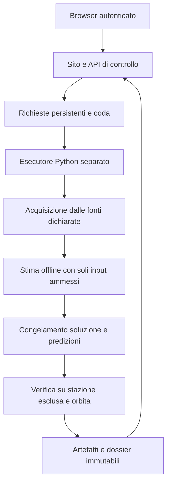

# Satellite-RF-Observatory — Piano complessivo del sito

Data: 9 settembre 2026. Stato: proposta operativa, fondata sul codice e sui risultati disponibili. Questo documento pianifica il lavoro: non avvia esperimenti, non modifica gli esiti congelati e non pubblica nuove versioni.

## 1. Il prodotto da costruire

La promessa del sito sarà: **scegli un satellite GPS e un giorno storico; controlla se esistono osservazioni adatte; richiedi una ricostruzione indipendente della posizione; consulta il risultato e le prove che lo sostengono.**

Il valore distintivo è rendere consultabile l'intero percorso dalle misure alla conclusione: selezione dichiarata della rete, ricostruzione senza l'orbita del bersaglio, incertezza fissata prima del confronto, prova su una stazione esclusa e confronto orbitale successivo. Questo è un obiettivo verificabile; non occorre affermare che il servizio sia l'unico al mondo.

La prima versione sarà un servizio privato per il proprietario e un eventuale piccolo gruppo di collaudo. Il pubblico potrà arrivare dopo, inizialmente con accesso ai risultati pubblicati. L'esecuzione di richieste avrà autenticazione, quote e regole proprie.

Questa evoluzione produce capacità di utilizzo, tracciabilità e riproduzione. Non introduce una nuova osservabile fisica né riduce automaticamente l'incertezza. L'eventuale dimostrazione di ripetibilità richiederà un programma scientifico distinto.

## 2. Da dove partiamo

Il motore Python gestisce già piano, acquisizione, disponibilità della rete, stima, verifica e dossier mediante un controllore locale. Esistono regole per reti fisse e per un insieme limitato di stazioni candidate, con scelta strutturale deterministica. Il sito Sites è invece un archivio statico privato di tre eventi.

| Evento concluso | Errore 3D osservato | Raggio prospettico condizionale | Esito originale |
|---|---:|---:|---|
| G08, 6 settembre 2026 | 188,705 m | 21.607,660 m | Incertezza superiore alla soglia |
| G12, 7 settembre 2026 | Non disponibile | Non disponibile | Misure non qualificate: 18 epoche comuni, richieste 41 |
| G12, 5 settembre 2026 | 15,139 m | 10.121,469 m | Incertezza superiore alla soglia |
| G13, 4 settembre 2026 | Non disponibile | Non disponibile | Nessuna epoca comune idonea nella rete dichiarata |
| G14, 3 settembre 2026 | 31,017 m | 5.755,157 m | Tutti i criteri dell'evento soddisfatti |

G14 è un successo per un singolo evento storico condizionale: il residuo sulla stazione GOLD esclusa è −0,846 m. Non dimostra precisione universale di 31 m, copertura statistica generale al 95%, velocità, orbita completa o identificazione autonoma del satellite.

Il primo debito del prodotto è concreto: `scripts/export_positioning_archive.py` esporta tre casi ed esclude esplicitamente risultati entro la soglia d'incertezza; `web/app/archive.tsx` tratta una posizione disponibile come un superamento della soglia. Occorre aggiornare insieme contratto dati, esportatore e presentazione. Aggiungere soltanto G14 al JSON produrrebbe una rappresentazione sbagliata.

Mancano ancora un servizio remoto durevole, un'API per le richieste web, l'autorizzazione sui singoli dossier e una gestione dei riavvii compatibile con il congelamento scientifico. Le CI già presenti sono una base da mantenere.

## 3. Struttura del sito e percorsi

| Area | Domanda dell'utente | Contenuto essenziale |
|---|---|---|
| Home `/` | Che cosa posso verificare? | Promessa concreta, limiti, avvio richiesta, risultati recenti |
| Archivio `/verifiche` | Che cosa è già stato tentato? | Tutti gli esiti pubblicabili, filtri, date, metodo e versioni |
| Richiesta `/nuova-verifica` | Quale caso voglio analizzare? | Satellite GPS, data, politica di rete e stazione esclusa |
| Richiesta in corso `/richieste/:id` | A che punto siamo? | Fase, eventi reali, disponibilità, eventuale impedimento |
| Risultato `/verifiche/:id` | Che cosa è stato dimostrato? | Posizione, incertezza, controlli, esito e dossier |
| Rete `/rete` | Quali osservazioni sono utilizzabili? | Rapporto della richiesta, stazioni, copertura e motivi di esclusione |
| Metodo `/metodo` | Posso fidarmi e riprodurre? | Ordine delle operazioni, assunzioni, convenzioni e limiti |

La disponibilità mostrata nella pagina rete sarà riferita a una richiesta e a una data di controllo. Non sarà presentata come disponibilità globale permanente delle stazioni.

Il percorso principale sarà:

1. Selezionare bersaglio e giorno storico; rendere esplicite le convenzioni GPST/UTC e il significato dell'etichetta GPS.
2. Mostrare il protocollo supportato e fissare piano, rete candidata, stazione esclusa, regole e versione del motore.
3. Avviare il controllo delle osservazioni. Anche questa operazione può richiedere un lavoro in background e download: non promettere una risposta istantanea.
4. Mostrare stazioni disponibili, mancanti o escluse, primo intervallo idoneo e rete scelta. Una rete idonea autorizza a tentare la calibrazione; non anticipa l'esito della posizione.
5. Consentire di proseguire sullo stesso piano e sugli stessi input congelati, senza una nuova selezione opportunistica.
6. Eseguire calibrazione, stima, congelamento e controlli separati; mantenere una pagina persistente anche chiudendo il browser.
7. Presentare un esito leggibile e un dossier scaricabile, compresi gli arresti per dati insufficienti.

All'inizio offriremo protocolli supportati, senza URL arbitrari o caricamenti di file da parte dell'utente. I dettagli avanzati saranno leggibili; cambiare soglie dopo un risultato non sarà un controllo dell'interfaccia.

I dati di confronto non sono sempre immediati: per esempio, i prodotti rapidi IGS riportano una latenza di 17–41 ore. Il sito dovrà verificare la disponibilità dei prodotti richiesti dal protocollo e descriversi come servizio storico. Fonte: [IGS — Products](https://igs.org/products/).

## 4. Come mostrare risultati e limiti

Separare due dimensioni in tutti i contratti e nelle schermate:

- **Stato operativo:** in coda, acquisizione, analisi disponibilità, calibrazione, stima, congelamento, verifica, concluso, interrotto o errore tecnico.
- **Esito scientifico:** criteri soddisfatti, incertezza eccessiva, misure non qualificate o altro terminale previsto dalla versione del metodo.

Una richiesta conclusa può avere un esito scientifico negativo. Un errore del server non deve diventare una conclusione sulla fisica. I dati mancanti resteranno mancanti, mai zero.

Ogni risultato mostrerà, nell'ordine: conclusione e ambito; posizione e istante di emissione con sistema di riferimento; incertezza dichiarata prima della verifica; errore osservato nel confronto successivo; prova sulla stazione esclusa; rete e intervallo; provenienza e download. Il lettore deve distinguere subito i 31 m osservati di G14 dai circa 5,76 km del suo raggio prospettico condizionale.

Conservare l'identità visiva attuale, migliorando gerarchia, leggibilità mobile, navigazione da tastiera e contrasto. Colore, icona e testo dovranno concordare. Le prime visualizzazioni utili sono la distribuzione delle stazioni, la copertura temporale e il confronto tra metriche e soglie.

Un globo 3D viene dopo il flusso completo. Se introdotto, dovrà rispettare coordinate, tempo e significato dell'incertezza: una regione nello spazio non diventa arbitrariamente un cerchio di accuratezza sul terreno. Nessuna animazione dovrà suggerire una traiettoria che il metodo non ha stimato.

## 5. Architettura proposta

Riutilizzare React/Vinext e il progetto Sites esistente. Conservare il motore scientifico Python come componente separato e versionato.

L'API web deve accettare una richiesta e rispondere rapidamente con un identificatore. Non eseguirà il risolutore durante una richiesta di pagina. Il runtime Workers usato da Sites ha un limite di memoria di 128 MB per isolate; è un ulteriore motivo per tenere elaborazione scientifica e grandi file fuori dal processo web. Fonte: [Cloudflare — Workers limits](https://developers.cloudflare.com/workers/platform/limits/).

La direzione iniziale è D1 per metadati e controllo delle richieste, R2 per gli artefatti, ed esecutore Python su un servizio persistente adeguato. Tuttavia, **prima di fissare questa integrazione occorre dimostrare il collegamento autenticato tra Sites privato ed esecutore**. Non assumere che un processo esterno possa attraversare il login della piattaforma con un normale token applicativo.

Il primo esperimento architetturale dovrà scegliere una sola soluzione praticabile:

- API di servizio supportata per consentire all'esecutore di prelevare richieste e registrare avanzamenti nel controllo centrale;
- oppure chiamate HTTPS in uscita da Sites a un gateway Python autenticato, che accetta lavori rapidamente e gestisce coda e stato autorevole, consultabili dal sito.

Se si sceglie il gateway, lo stato sul sito sarà una proiezione chiaramente definita. Non costruire due code o due archivi di stato entrambi considerati autorevoli. La scelta dell'hosting dell'esecutore dipenderà da questa prova, dalle misure di risorse e dal budget, non da un cambio di framework preventivo.

Il passaggio da esportazione statica a sito con API sarà una modifica esplicita della build e del deployment, mantenendo l'archivio funzionante come prima consegna e come riferimento per eventuale rollback.

## 6. Contratti, dati e integrità

Introdurre un contratto versionato comune per risultati storici e nuove esecuzioni. Gli adattatori importeranno i casi precedenti senza riscriverne i file congelati. Ogni caso dichiarerà identificatore, versione del protocollo, commit scientifico pertinente, input e hash, rete, tempi, esito, metriche e riferimenti agli artefatti. Una sola revisione globale non basta a descrivere implementazioni storiche differenti.

Le entità minime sono richiesta, tentativo, piano, evento di fase, ricevuta di fonte, risultato e artefatto. Registrare proprietario, chiave di idempotenza, hash canonico del piano, versione dell'esecutore e relazioni tra questi oggetti. I byte dei dossier e dei file osservativi resteranno nello storage a oggetti; la pagina iniziale caricherà solo un riepilogo leggero.

La cache deve conservare URL dichiarato, hash dei byte e ricevute. Un file recuperato nuovamente e cambiato non sostituisce silenziosamente l'input congelato. Non usare una fonte alternativa se il piano non la prevede. Distinguere file assente, stazione non idonea, dati insufficienti e guasto di trasporto.

La pipeline remota manterrà la separazione già prevista dal metodo. La fase di stima dovrà avere isolamento di rete effettivo e accesso soltanto agli input ammessi; il riferimento orbitale del bersaglio e i valori esclusi per conferma non saranno montati nel suo ambiente. La verifica controllerà il congelamento prima di accedere alle conferme. Hash e log aiutano l'audit, ma non equivalgono a una prova pubblica indipendente del momento di acquisizione.

Le correzioni editoriali avranno revisioni tracciate. Una correzione che cambia la validità scientifica richiederà un avviso e una nuova versione dello stato pubblicato; non cancellare la storia dell'esito originale.

## 7. Affidabilità e controllo degli accessi

Partire con un solo esecutore concorrente, coda limitata e quote configurabili. Introdurre concessioni temporanee del lavoro, heartbeat e scadenze, impedendo che due processi eseguano lo stesso tentativo. L'invio ripetuto di una richiesta con la stessa chiave restituirà lo stesso identificatore.

I riavvii richiedono una politica per fase. Un download interrotto può avere una ripresa controllata con verifica dei byte. Dopo l'accesso alle conferme non deve partire automaticamente una nuova stima. Un arresto nel punto critico tra congelamento e rivelazione richiede ricevute durevoli e un percorso esplicito di recupero o invalidazione. La semplice ripetizione automatica dei messaggi di coda non è sufficiente.

Un replay di G14 è utile per collaudare il servizio, ma va etichettato come replay e non contato come nuova prova. Anche l'esecuzione di una richiesta già conosciuta deve mostrare tale provenienza.

Autenticazione e autorizzazione sono controlli distinti: ogni API dovrà verificare chi può leggere, eseguire, interrompere o scaricare quella specifica richiesta. Non fidarsi di proprietari dichiarati dal client. L'accesso a un URL di artefatto deve rispettare la stessa visibilità del dossier.

Per il primo servizio bastano notifiche dentro il sito, log di fase, diagnostica operativa e una procedura di ripristino provata. Introdurre metriche per durata delle fasi, coda, errori tecnici, disponibilità delle fonti e costi di risorse. Mantenere separato il conteggio degli esiti scientifici negativi dagli incidenti di servizio.

## 8. Consegne e criteri di accettazione

| Fase | Consegna | Condizione per considerarla finita |
|---|---|---|
| P0 — Archivio coerente | Contratto versionato, esportatore e UI per tutti e cinque gli eventi | G14 positivo e G13 senza posizione rappresentati correttamente; esiti storici invariati; dossier e provenienza verificati |
| P1 — Collegamento remoto | Prova di autenticazione, persistenza, esecutore e storage | Un lavoro tecnico attraversa browser, servizio ed esecutore; sopravvive alla chiusura del browser; accessi ai file controllati |
| P2 — Richiesta privata completa | Form, disponibilità, avanzamento, esecuzione e dossier | Dal sito si completa un replay dichiarato senza terminale sul PC dell'utente; esito positivo e arresto scientifico entrambi corretti |
| P3 — Robustezza e collaudo | Recupero interruzioni, quote, osservabilità, backup e UX | Superati i casi di duplicazione, riavvio e isolamento utenti; ripristino provato; costi per esecuzione misurati |
| P4 — Apertura controllata | Archivio pubblico, poi eventuali richieste limitate | Decisione esplicita sul pubblico, documentazione, attribuzioni delle fonti, controllo dei costi e procedure operative pronti |
| P5 — Estensione scientifica | Programma separato di validazione e nuovi metodi | Protocollo preregistrato, pubblicazione di tutti gli esiti e valutazione delle prestazioni sul campione dichiarato |

Non assegniamo date arbitrarie prima della prova P1. Ogni fase termina con una versione utilizzabile e un controllo di accettazione. Le fasi di prodotto non autorizzano automaticamente nuovi esperimenti scientifici o un lancio pubblico.

I primi ticket, nell'ordine, saranno:

1. **P0.1 — Schema dei risultati:** modellare separatamente stato, esito, metriche opzionali e provenienza per evento; verificare i cinque record congelati.
2. **P0.2 — Esportazione deterministica:** importare G13 e G14, rimuovere l'assunzione di soli fallimenti e controllare corrispondenza fra riepilogo e dossier.
3. **P0.3 — Interfaccia e testi:** introdurre presentazione degli esiti generica, correggere il calcolo del superamento soglia e aggiornare la documentazione corrente senza alterare quella storica.
4. **P1.1 — Prova del collegamento:** risolvere autenticazione tra servizi, storage privato e persistenza di un lavoro tecnico minimo; documentare la scelta architetturale.
5. **P1.2 — Contratto della richiesta:** definire API, proprietà, idempotenza, transizioni ammesse e regole di recupero; quindi collegare il controllore Python.

## 9. Verifica della qualità

Mantenere le CI esistenti e aggiungere controlli solo dove proteggono comportamenti reali. Il collaudo dovrà coprire:

- importazione corretta di tutti i cinque esiti, senza metriche inventate o soglie modificate;
- percorso browser → API → esecutore → dossier, usando replay esplicitamente identificati di un successo e di un caso con osservazioni insufficienti;
- aggiornamento e riapertura della pagina durante un lavoro; doppio invio e doppia acquisizione del lavoro;
- interruzione prima e dopo il congelamento e dopo l'accesso alle conferme, senza una ristima silenziosa;
- accesso negato a richieste e file di altri utenti; integrità dei download e ripristino da backup;
- interfaccia utilizzabile da tastiera e su schermo piccolo, con errori e dati mancanti leggibili.

Una nuova prova scientifica non è un test ordinario di deployment. Le verifiche software riutilizzano i casi congelati o dati tecnici sintetici con etichetta esplicita.

## 10. Costi, crescita e decisioni aperte

Misurare memoria massima dell'esecutore, tempi per fase, byte scaricati e decompressi, dimensione degli artefatti, traffico di download e riutilizzo della cache. Il pacchetto G14 già prodotto è di circa 32,4 MB compressi: non rappresenta né tutta la memoria di lavoro né una dimensione massima garantita per le richieste future.

Dimensionare inizialmente per poche richieste seriali, con limiti visibili prima dell'invio. Definire una politica distinta per file temporanei, cache e dossier congelati; ogni eventuale eliminazione degli originali deve essere compatibile con le promesse di riproducibilità e dichiarata nel risultato.

Prima del servizio operativo restano da fissare hosting e budget dell'esecutore, utenti del collaudo, conservazione dei dati e percorso di autenticazione supportato. Prima dell'apertura pubblica serviranno inoltre la scelta del pubblico ammesso e la verifica delle condizioni di attribuzione e redistribuzione delle fonti. Queste decisioni non impediscono di completare P0 e preparare P1.

La crescita scientifica seguirà una linea separata: campione dichiarato di eventi su giorni e geometrie differenti, inclusione di insuccessi e indisponibilità, studio dell'incertezza e della sensibilità alle assunzioni. Altre costellazioni, Doppler, fase portante, velocità o orbite richiederanno protocolli e verifiche propri prima di diventare funzioni promesse dal sito.

**Priorità consigliata:** completare l'archivio a cinque eventi e poi dimostrare il collegamento remoto. La prima vera soglia di prodotto sarà una richiesta privata completata interamente dal sito, con avanzamento persistente, risultato onesto e dossier verificabile, senza dipendere dal terminale dell'utente.
